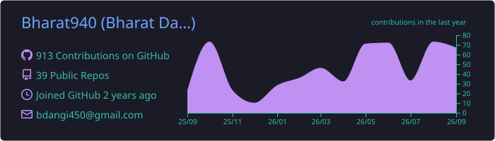
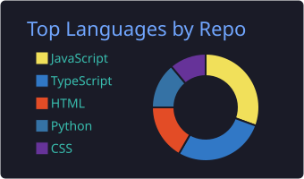
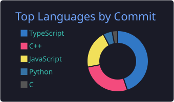
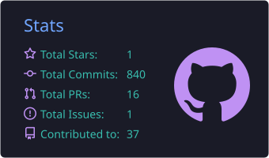

### Bharat Dangi
*Full Stack & Agentic AI Developer*

B.Tech IT student at UIT, RGPV (Bhopal), currently interning as an Agentic AI Developer at EasyDevs — multi-agent orchestration, dynamic context management, and lead-automation workflows. Before that, full-stack work at SoundSpire.

I split my time between low-level C++ (parsers, ray tracers, compilers) and TypeScript backends (Next.js, tRPC, distributed job processing) — and lately, agentic AI: tool-calling, context management, RAG.

[Portfolio](https://bharat-dangi.vercel.app/) · [Projects](https://bharat-dangi.vercel.app/projects) · [Blog](https://bharat-dangi.vercel.app/blog) · [LinkedIn](https://www.linkedin.com/in/bharat-dangi-b186b3248/) · [X](https://x.com/Bharatdangi322) · bdangi450@gmail.com

**Stack:** C++ · TypeScript · Python · Next.js · tRPC · PostgreSQL · Redis · Docker · OpenAI SDK · LangChain

---

**A few things I've built**

- **[NodeWeave](https://github.com/Bharat940/NodeWeave)** — a workflow-automation platform in the spirit of Zapier/Temporal, self-built: fault-tolerant job retries, cron scheduling, sandboxed execution, async processing via Inngest, 250+ concurrent runs.
- **[Ray Tracer](https://github.com/Bharat940/Raytracing-Cpp)** — a Monte Carlo path tracer from scratch in C++: diffuse/metal/dielectric materials, recursive light scattering, OpenMP-parallelized rendering.
- **[Math Plotter](https://github.com/Bharat940/Simple-math-calculator-and-plotter)** — a C++17 expression compiler with its own Pratt parser and an AST optimization pass (constant folding, algebraic simplification), plus a real-time SDL2 plotting GUI.
- **[Engrapha](https://github.com/Bharat940/engrapha)** — a Python library for generating PDFs and brand assets programmatically.

---

  

  
  

  

---

